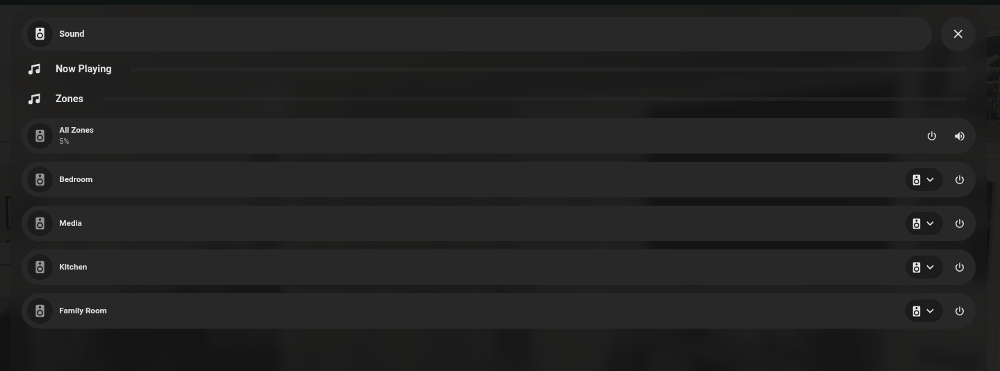
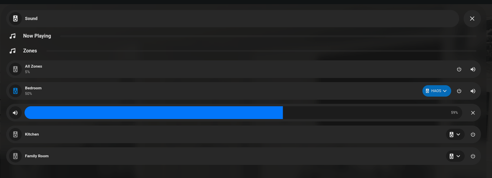

# Legrand Digital Audio Integration for Home Assistant

[](https://analytics.home-assistant.io/custom_integrations.json)
[![hacs][hacsbadge]][hacs]
[![Maintainer][maintainer-shield]][main-branch]
[![GitHub Release][releases-shield]][releases]
[![License][license-shield]](LICENSE)

This integration allows you to control Legrand Digital Audio systems through Home Assistant.

## Installation

### HACS (Recommended)

1. Open HACS in Home Assistant
2. Click on "Integrations"
3. Click the "+" button
4. Added this repo as a custom repository
5. Restart HA


### Manual Installation

1. Copy the `custom_components/legrand_digital_audio` directory to your Home Assistant's `custom_components` directory
2. Restart Home Assistant

## Configuration

1. Go to Settings -> Devices & Services
2. Click "Add Integration"
3. Search for "Legrand Digital Audio"
4. Enter your device's IP address and port

## Features

- Control multiple audio zones
- Power on/off
- Volume control
- Source selection
- Mute/unmute

## Home Assistant - Dashoard Examples

Below you can find some examples of usage of this custom component using a media player card within a bubble card.

### Entities in dashboard as media player cards



Each zone is given its own entity, with all zones controlling every zone.



Here you can see zones being turned on, changing of the sources, and changing volume.

Below is the yaml for these media player cards, using the bubble card add-on.

```yaml
  - type: custom:bubble-card
    card_type: media-player
    button_type: slider
    name: All Zones
    entity: media_player.legrand_audio_zone_all
    icon: mdi:speaker
    show_state: false
    attribute: volume_level
    show_attribute: true
    show_last_changed: false
    hide:
      play_pause_button: true
      previous_button: true
      next_button: true
    styles: |
      .bubble-range-fill { 
        background: rgb(2, 118, 250) !important;
        opacity: 1 !important;
      }

  - type: custom:bubble-card
    card_type: media-player
    button_type: slider
    name: Bedroom
    entity: media_player.legrand_audio_zone_bedroom
    icon: mdi:speaker
    show_state: false
    attribute: volume_level
    show_attribute: true
    show_last_changed: false
    hide:
      play_pause_button: true
      previous_button: true
      next_button: true
    styles: |
      .bubble-range-fill { 
        background: rgb(2, 118, 250) !important;
        opacity: 1 !important;
      }
    sub_button:
      - entity: media_player.legrand_audio_zone_bedroom
        select_attribute: source_list
        name: Sources
        show_state: false 
        show_attribute: true
        attribute: source 

  - type: custom:bubble-card
    card_type: media-player
    button_type: slider
    name: Media
    entity: media_player.legrand_audio_zone_media_room
    icon: mdi:speaker
    show_state: false
    attribute: volume_level
    show_attribute: true
    show_last_changed: false
    hide:
      play_pause_button: true
      previous_button: true
      next_button: true
    styles: |
      .bubble-range-fill { 
        background: rgb(2, 118, 250) !important;
        opacity: 1 !important;
      }
    sub_button:
      - entity: media_player.legrand_audio_zone_media_room
        select_attribute: source_list
        name: Sources
        show_state: false 
        show_attribute: true
        attribute: source

  - type: custom:bubble-card
    card_type: media-player
    button_type: slider
    name: Kitchen
    entity: media_player.legrand_audio_zone_kitchen
    icon: mdi:speaker
    show_state: false
    attribute: volume_level
    show_attribute: true
    show_last_changed: false
    hide:
      play_pause_button: true
      previous_button: true
      next_button: true
    styles: |
      .bubble-range-fill { 
        background: rgb(2, 118, 250) !important;
        opacity: 1 !important;
      }
    sub_button:
      - entity: media_player.legrand_audio_zone_kitchen
        select_attribute: source_list
        name: Sources
        show_state: false 
        show_attribute: true
        attribute: source

        
  - type: custom:bubble-card
    card_type: media-player
    button_type: slider
    name: Family Room
    entity: media_player.legrand_audio_zone_living_room
    icon: mdi:speaker
    show_state: false
    attribute: volume_level
    show_attribute: true
    show_last_changed: false
    hide:
      play_pause_button: true
      previous_button: true
      next_button: true
    styles: |
      .bubble-range-fill { 
        background: rgb(2, 118, 250) !important;
        opacity: 1 !important;
      }
    sub_button:
      - entity: media_player.legrand_audio_zone_living_room
        select_attribute: source_list
        name: Sources
        show_state: false 
        show_attribute: true
        attribute: source
```

## Support

For issues and feature requests, please use the [GitHub Issues][issues] page.


---

[commits-shield]: https://img.shields.io/github/commit-activity/y/jholula/legrand-digital-audio-integration.svg
[commits]: https://github.com/jholula/legrand-digital-audio-integration/commits/main
[hacs]: https://github.com/hacs/integration
[hacsbadge]: https://img.shields.io/badge/HACS-Custom-orange.svg
[license-shield]: https://img.shields.io/github/license/jholula/legrand-digital-audio-integration.svg
[releases-shield]: https://img.shields.io/github/release/jholula/legrand-digital-audio-integration.svg
[releases]: https://github.com/jholula/legrand-digital-audio-integration/releases
[issues]: https://github.com/jholula/legrand-digital-audio-integration/issues
[maintainer-shield]: https://img.shields.io/badge/maintainer-@jholula-blue.svg
[main-branch]: https://github.com/jholula/legrand-digital-audio-integration/tree/main