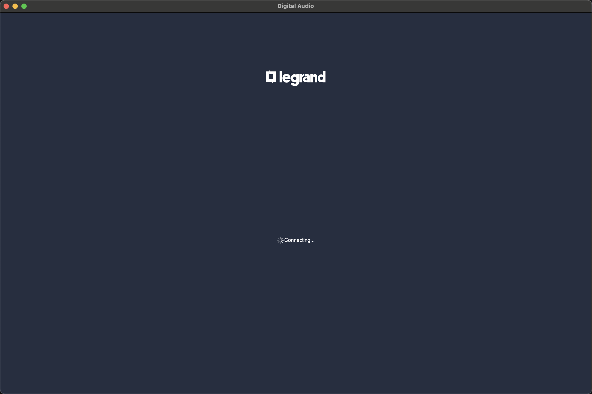
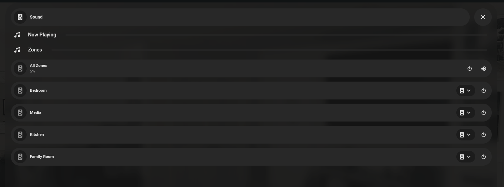
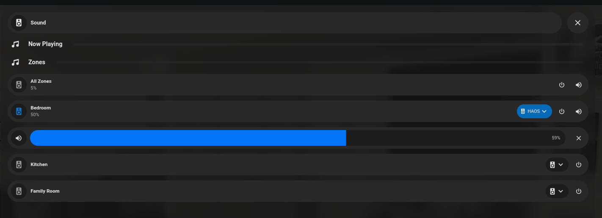
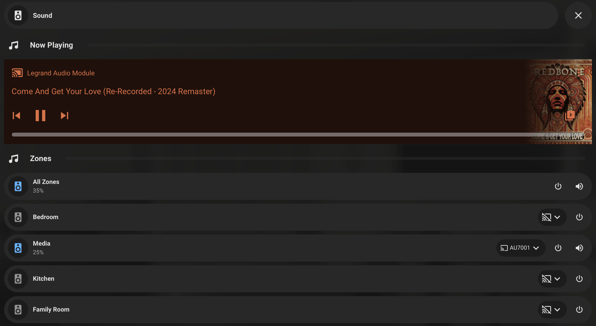
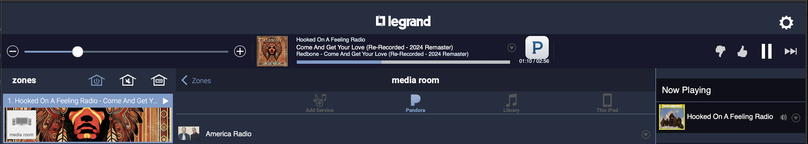
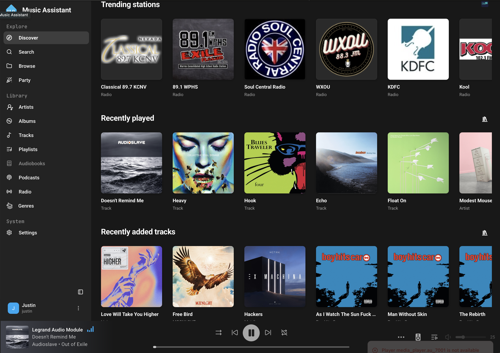
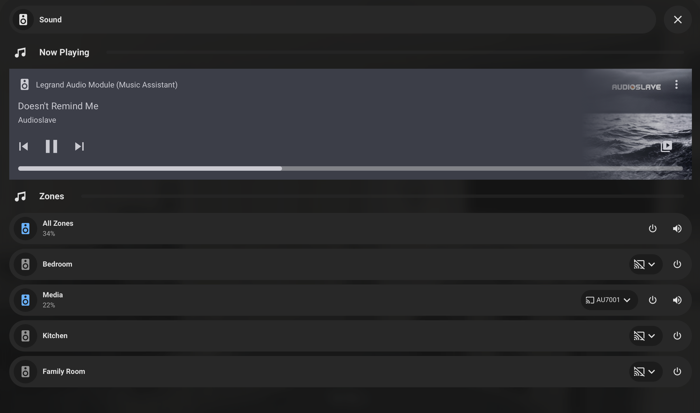
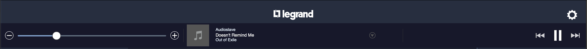

# Legrand Digital Audio Integration for Home Assistant

[](https://analytics.home-assistant.io/custom_integrations.json)
[![hacs][hacsbadge]][hacs]
[![Maintainer][maintainer-shield]][main-branch]
[![GitHub Release][releases-shield]][releases]
[![License][license-shield]](LICENSE)

Control Legrand / NuVo Digital Audio systems from Home Assistant — whole-house zones (**AU7000**) and streaming modules (**AU7001**). Automate speakers with automations, scripts, scenes, and dashboards; no Digital Audio app required for day-to-day control.

## Table of contents

- [Features](#features)
- [Installation](#installation)
- [Configuration](#configuration)
- [Binding the AU7001](#binding-the-au7001)
- [Automations](#automations)
- [Examples](#examples)
  - [AU7000 zone dashboard](#au7000-zone-dashboard)
  - [AU7001 in Home Assistant](#au7001-in-home-assistant)
  - [Music Assistant to AU7001](#music-assistant-to-au7001)
- [Support](#support)

## Features

### AU7000 — distribution module

- Control multiple audio zones (plus an “all zones” entity)
- Power on/off, volume, mute, and source selection
- Full Home Assistant automation: schedules, presence, voice assistants, scenes, and scripts

### AU7001 — streaming module

- Media player for Pandora browse and other onboard services
- Music Assistant (and other) HTTP stream playback with title, artist, album, and artwork on the module / keypads (via an ID3 stream proxy)
- **Start bind** button + `attempt_bind` service (replaces Bind Digital Source in the app)
- Bind status attributes for diagnostics

## Installation

### HACS (Recommended)

1. Open HACS in Home Assistant
2. Click on "Integrations"
3. Click the "+" button
4. Add this repo as a custom repository
5. Restart Home Assistant

### Manual Installation

1. Copy the `custom_components/legrand_digital_audio` directory to your Home Assistant's `custom_components` directory
2. Restart Home Assistant

## Configuration

1. Go to **Settings → Devices & Services**
2. Click **Add Integration**
3. Search for **Legrand Digital Audio**
4. Pick a discovered **AU7000** (distribution module) and/or **AU7001** (streaming module), or enter the IP manually

Most installs add both: the AU7000 for zone power/volume/source, and the AU7001 for streaming (browse, Music Assistant, etc.).

## Binding the AU7001

Previously you had to use the Legrand **Digital Audio** app (Settings → **Bind Digital Source**) and press the physical bind button on the AU7001. That app step is **no longer needed**:



In Home Assistant instead:

1. Open the AU7001 device
2. Press the **Start bind** button (or call the `attempt_bind` entity service)
3. Press the physical bind button on the AU7001 until the LED is **solid white**

You can confirm bind health on the media player entity via attributes such as `bind_status`, `bind_hint`, and `system_id`.

> Optional: the Digital Audio app can still be used to sign in to Pandora / Spotify if you want those services in the onboard browser. Day-to-day zone control and Music Assistant streaming do not require the app.

## Automations

Each zone is a standard Home Assistant **media player**:

- Turn zones **on/off** (including an all-zones entity)
- **Change source** per zone (or all zones)
- Set **volume** and **mute**
- Trigger from time, motion, presence, buttons, Assist, or any other HA automation

Example: turn on the kitchen zone and select a source when someone arrives home, or power everything off at bedtime with a single automation.

## Examples

Jump to a gallery:

- [AU7000 zone dashboard](#au7000-zone-dashboard)
- [AU7001 in Home Assistant](#au7001-in-home-assistant)
- [Music Assistant to AU7001](#music-assistant-to-au7001)

### AU7000 zone dashboard

Media player cards (bubble card) for whole-house zones:



Each zone is given its own entity, with all zones controlling every zone.



Zones turned on, sources changed, and volume adjusted.

YAML for these media player cards (bubble card add-on):

```yaml
  - type: custom:bubble-card
    card_type: media-player
    button_type: slider
    name: All Zones
    entity: media_player.legrand_audio_zone_all
    icon: mdi:speaker
    show_state: false
    attribute: volume_level
    show_attribute: true
    show_last_changed: false
    hide:
      play_pause_button: true
      previous_button: true
      next_button: true
    styles: |
      .bubble-range-fill { 
        background: rgb(2, 118, 250) !important;
        opacity: 1 !important;
      }

  - type: custom:bubble-card
    card_type: media-player
    button_type: slider
    name: Bedroom
    entity: media_player.legrand_audio_zone_bedroom
    icon: mdi:speaker
    show_state: false
    attribute: volume_level
    show_attribute: true
    show_last_changed: false
    hide:
      play_pause_button: true
      previous_button: true
      next_button: true
    styles: |
      .bubble-range-fill { 
        background: rgb(2, 118, 250) !important;
        opacity: 1 !important;
      }
    sub_button:
      - entity: media_player.legrand_audio_zone_bedroom
        select_attribute: source_list
        name: Sources
        show_state: false 
        show_attribute: true
        attribute: source 

  - type: custom:bubble-card
    card_type: media-player
    button_type: slider
    name: Media
    entity: media_player.legrand_audio_zone_media_room
    icon: mdi:speaker
    show_state: false
    attribute: volume_level
    show_attribute: true
    show_last_changed: false
    hide:
      play_pause_button: true
      previous_button: true
      next_button: true
    styles: |
      .bubble-range-fill { 
        background: rgb(2, 118, 250) !important;
        opacity: 1 !important;
      }
    sub_button:
      - entity: media_player.legrand_audio_zone_media_room
        select_attribute: source_list
        name: Sources
        show_state: false 
        show_attribute: true
        attribute: source

  - type: custom:bubble-card
    card_type: media-player
    button_type: slider
    name: Kitchen
    entity: media_player.legrand_audio_zone_kitchen
    icon: mdi:speaker
    show_state: false
    attribute: volume_level
    show_attribute: true
    show_last_changed: false
    hide:
      play_pause_button: true
      previous_button: true
      next_button: true
    styles: |
      .bubble-range-fill { 
        background: rgb(2, 118, 250) !important;
        opacity: 1 !important;
      }
    sub_button:
      - entity: media_player.legrand_audio_zone_kitchen
        select_attribute: source_list
        name: Sources
        show_state: false 
        show_attribute: true
        attribute: source

        
  - type: custom:bubble-card
    card_type: media-player
    button_type: slider
    name: Family Room
    entity: media_player.legrand_audio_zone_living_room
    icon: mdi:speaker
    show_state: false
    attribute: volume_level
    show_attribute: true
    show_last_changed: false
    hide:
      play_pause_button: true
      previous_button: true
      next_button: true
    styles: |
      .bubble-range-fill { 
        background: rgb(2, 118, 250) !important;
        opacity: 1 !important;
      }
    sub_button:
      - entity: media_player.legrand_audio_zone_living_room
        select_attribute: source_list
        name: Sources
        show_state: false 
        show_attribute: true
        attribute: source
```

### AU7001 in Home Assistant

Browse and play onboard services (for example Pandora) from the AU7001 media player. Now-playing shows in Home Assistant, and the same track appears in the Digital Audio app when a zone is on that source.





### Music Assistant to AU7001

Add the AU7001 `media_player` as a **Home Assistant player** in Music Assistant. Streams play on the Legrand Audio Module; metadata is pushed so Home Assistant and the Digital Audio UI show the current track.







## Support

For issues and feature requests, please use the [GitHub Issues][issues] page.

---

[commits-shield]: https://img.shields.io/github/commit-activity/y/jholula/legrand-digital-audio-integration.svg
[commits]: https://github.com/jholula/legrand-digital-audio-integration/commits/main
[hacs]: https://github.com/hacs/integration
[hacsbadge]: https://img.shields.io/badge/HACS-Custom-orange.svg
[license-shield]: https://img.shields.io/github/license/jholula/legrand-digital-audio-integration.svg
[releases-shield]: https://img.shields.io/github/release/jholula/legrand-digital-audio-integration.svg
[releases]: https://github.com/jholula/legrand-digital-audio-integration/releases
[issues]: https://github.com/jholula/legrand-digital-audio-integration/issues
[maintainer-shield]: https://img.shields.io/badge/maintainer-@jholula-blue.svg
[main-branch]: https://github.com/jholula/legrand-digital-audio-integration/tree/main
